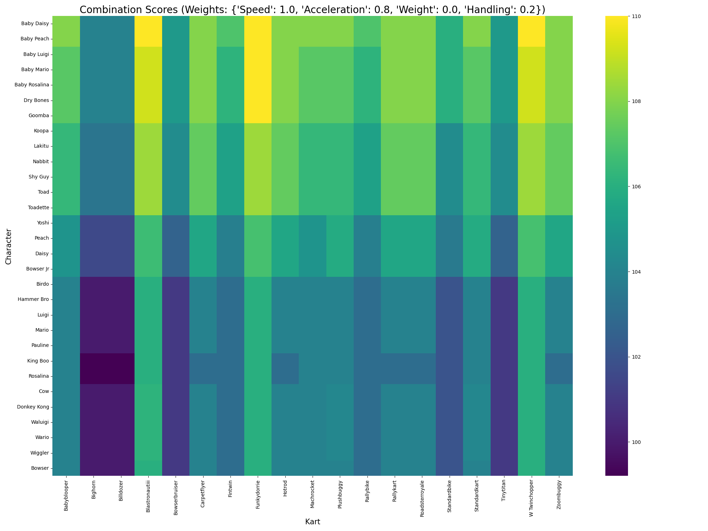

# Mario Kart World - Build Optimizer


A machine learning-powered command-line tool to predict vehicle stats and find the optimal Character/Kart combinations in the fictional game 'Mario Kart World'.

This project tackles a common data science problem: making robust predictions from a limited dataset. Using only the official stats for "Mario" in every vehicle, this tool trains a neural network to infer the final stats for **any character** in **any kart**.

---

## Table of Contents

- [About The Project](#about-the-project)
  - [Key Features](#key-features)
  - [Methodology](#methodology)
- [Project Structure](#project-structure)
- [Getting Started](#getting-started)
  - [Prerequisites](#prerequisites)
  - [Installation](#installation)
- [Usage](#usage)
  - [1. Train the Model](#1-train-the-model)
  - [2. Predict a Single Combination](#2-predict-a-single-combination)
  - [3. Search for Optimal Builds](#3-search-for-optimal-builds)
  - [4. Generate a Performance Heatmap](#4-generate-a-performance-heatmap)
  - [5. Advanced: Evaluate & Optimize](#5-advanced-evaluate--optimize)
- [Example Output](#example-output)

---

## About The Project

This tool was created to solve the challenge of finding the best vehicle builds when only a small fraction of "ground truth" data is available. It leverages a PyTorch model trained with a **delta-based data augmentation** technique, allowing it to generalize from a single character's data (Mario) to the entire roster.

### Key Features

- **Stat Prediction:** Accurately predicts the final stats (Speed, Acceleration, Weight, Handling) for any character/kart combination.
- **Weighted Search:** Finds the best builds based on custom user-defined priorities (e.g., focus on speed, acceleration, or a balanced profile).
- **Heatmap Visualization:** Generates a comprehensive heatmap of all combinations, providing a bird's-eye view of the best choices for any playstyle.
- **Advanced Evaluation:** Includes built-in cross-validation to objectively measure model performance.
- **Hyperparameter Optimization:** Utilizes Optuna to automatically find the best model architecture and training parameters.

### Methodology

The core challenge is that the training data only contains `Mario + Kart` combinations. A naive model would fail to learn the influence of different characters. This project solves this by:
1.  **Using a Delta-Based Approach:** The model doesn't predict absolute stats. Instead, it predicts the **change (delta)** in final stats when switching from Mario to another character.
2.  **Data Augmentation:** To teach the model about non-zero deltas, we create a synthetic training set. We make a reasonable assumption that the relationship between base stats and final stats is roughly linear. We generate "fake" but logical training data for heavy (Bowser) and light (Toad) characters, forcing the model to learn a meaningful relationship.

## Project Structure

The project is organized into modular components for clarity and maintainability.

```
.
├── data/
│   ├── characters.csv
│   ├── karts.csv
│   └── mario_kart_combos_100.csv
├── model/
│   ├── scaler_X.pkl
│   ├── scaler_Y.pkl
│   └── stat_predictor.pth
├── output/
│   ├── all_combinations_stats.csv
│   ├── combinations_heatmap.png
│   └── top_..._builds.csv
├── .gitignore
├── config.py
├── main.py
├── model.py
├── optimizer.py
└── requirements.txt
```
- **`data/`**: Contains the raw input CSV files.
- **`model/`**: Stores the trained PyTorch model and the data scalers.
- **`output/`**: All generated files (rankings, heatmaps, full combination list) are saved here.
- **`config.py`**: Central configuration for all file paths and model hyperparameters.
- **`main.py`**: The main command-line interface (CLI) orchestrator.
- **`model.py`**: Defines the `StatPredictor` neural network and the training/evaluation logic.
- **`optimizer.py`**: Contains the `MKWorldOptimizer` class responsible for prediction and analysis.

## Getting Started

Follow these steps to get the project up and running on your local machine.

### Prerequisites

- Python 3.9+

### Installation

1.  **Clone the repository:**
    ```bash
    git clone https://github.com/St0lym/mkw_s.git
    cd mario-kart-optimizer
    ```
2.  **Create and activate a virtual environment (recommended):**
    ```bash
    python -m venv venv
    source venv/bin/activate  # On Windows, use `venv\Scripts\activate`
    ```
3.  **Install the required packages:**
    ```bash
    pip install -r requirements.txt
    ```
4.  **Place your data:** Ensure your three CSV files (`characters.csv`, `karts.csv`, `mario_kart_combos_100.csv`) are placed inside the `data/` directory.

## Usage

The tool is operated via the command line from the root directory of the project.

### 1. Train the Model

This is the first command you must run. It will train the model based on your data and save the results in the `model/` directory.

```bash
python main.py --train
```
To force the model to retrain from scratch, even if a model file already exists:
```bash
python main.py --force-retrain
```

### 2. Predict a Single Combination

Predict the stats for a specific build.
- Character names with spaces must be enclosed in quotes.
- Kart names must be lowercase with no spaces (as in your `karts.csv` file).

```bash
python main.py --predict "Baby Peach" biddybuggy
```

### 3. Search for Optimal Builds

Find the best combinations based on your priorities. You can use pre-defined profiles or custom weights.

**Using a pre-defined profile:**
```bash
# Find the top 15 builds for maximum speed
python main.py --search --profile max_speed --top_n 15

# Find balanced builds
python main.py --search --profile balanced
```
Available profiles: `balanced`, `max_speed`, `max_accel`, `max_handling`.

**Using custom weights:**
```bash
# Search for builds with high acceleration and good handling
python main.py --search --accel 1.0 --handling 0.7
```
All search results are printed to the console and saved as a CSV file in the `output/` folder.

### 4. Generate a Performance Heatmap

Visualize the scores of all possible combinations for a given set of weights or profile.

```bash
python main.py --heatmap --profile max_accel
```
The resulting image (`combinations_heatmap.png`) will be saved in the `output/` folder.

### 5. Advanced: Evaluate & Optimize

These commands are for advanced users looking to improve the model itself.

**Evaluate the model's accuracy:**
This runs a Leave-One-Out Cross-Validation and reports the Mean Absolute Error (MAE), giving you an objective score of the model's prediction accuracy.
```bash
python main.py --evaluate
```

**Automatically find the best hyperparameters:**
This uses the Optuna library to run 100 trials and find the best combination of learning rate, model architecture, and data augmentation factors. This can take several minutes.
```bash
python main.py --optimize
```
The results will guide you on how to update `config.py` for an even more accurate model.

## Example Output

**Search Result (Console)**
```bash
python main.py --search --speed 1.0 --accel 0.8 --handling 0.2 --weight 0.0 --top_n 20 --heatmap
```
```
--- Finding Top 20 Builds with weights: {'Speed': 1.0, 'Acceleration': 0.8, 'Weight': 0.0, 'Handling': 0.2} ---
         Character            Kart  Speed  Acceleration  Weight  Handling  Score
46      Baby Luigi     Funkydorrie     41            74      36        49  110.0
103      Dry Bones     Funkydorrie     41            74      36        49  110.0
27      Baby Peach     Funkydorrie     40            75      35        50  110.0
24      Baby Peach  Blastronautiii     35            80      30        55  110.0
33      Baby Peach   W Twinchopper     45            65      25        65  110.0
14      Baby Daisy   W Twinchopper     45            65      25        65  110.0
122         Goomba     Funkydorrie     41            74      36        49  110.0
8       Baby Daisy     Funkydorrie     40            75      35        50  110.0
81   Baby Rosalina  Blastronautiii     36            78      32        54  109.2
62      Baby Mario  Blastronautiii     36            78      32        54  109.2
128         Goomba   W Twinchopper     46            63      27        64  109.2
52      Baby Luigi   W Twinchopper     46            63      27        64  109.2
43      Baby Luigi  Blastronautiii     36            78      32        54  109.2
119         Goomba  Blastronautiii     36            78      32        54  109.2
```  

**Heatmap (`output/combinations_heatmap.png`)**
